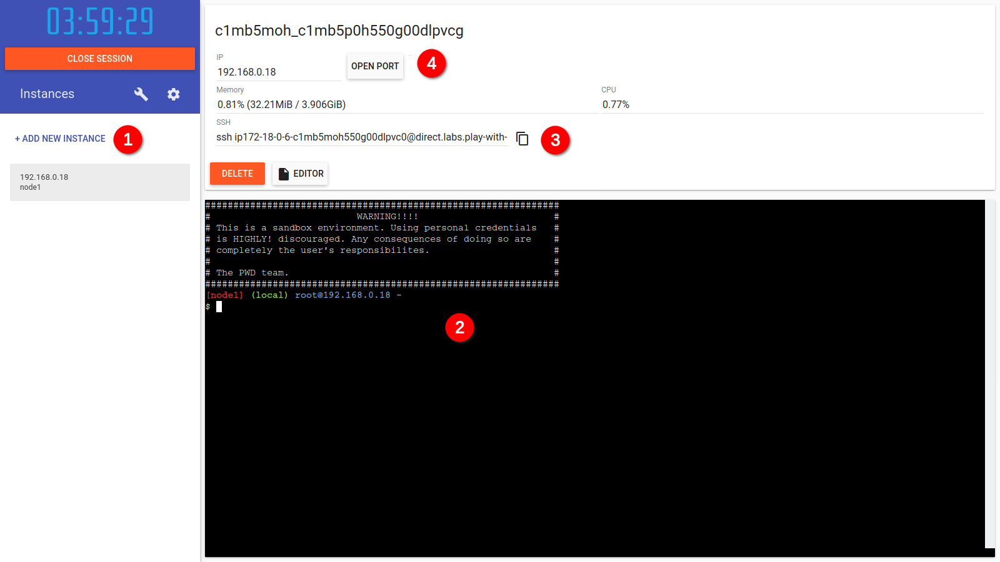

# Containers - Dia 2

Os passos deverão ser feitos em https://labs.play-with-docker.com, para isso é preciso ter uma conta em https://hub.docker.com/.



  1. Criar uma única instância
  2. Usar o terminal, esta distribuição é um [Linux Alpine](https://alpinelinux.org/)
  3. Utilizar este endereço caso queira fazer SSH (não é necessário)
  4. Utilizar este botão para expor uma porta da máquina/contêiner na internet

> **Importante:** Se conhece pouco de Linux, instalar via terminal o editor **nano**: `apk add nano`

## Docker

### Essencial

  1. Criar contêineres
    - Hello World
    - Apache
  2. Listar contêineres
    - Contêineres ativos
    - Contêineres mortos
    - O comando principal
  3. Images e Docker Hub
  4. Criar um contêiner desatachado
    - Dar nomes aos contêineres
  5. A rede interna do Docker
    - `container inspect`
  6. Entrar no contêiner e modificar arquivos
    - Os parâmetros `--tty` e `--interactive` (de novo)
  7. Variáveis de ambiente
  8. Contêineres "puros"
    - O comando principal (de novo)
    - Os parâmetros `--tty` e `--interactive` (de novo)
  9. Limpeza
    - stop
    - rm
    - subshell

### Portas

  1. Explicação sobre portas, o que expor e o que não expor.
  2. Fazer um NAT entre a **máquina hospedeira** e o contêiner para facilitar acessos e testes.

### Volumes

  1. Explicar os diferentes tipos de volumes
    - NFS
    - iSCSI
    - Volumes na Cloud
  2. Criar um **bind mount** para facilitar o teste de um site simples.

## Aplicação

### Banco de Dados

```bash
docker container run -dti --name mysql -p 3306:3306 \
-e MYSQL_ROOT_PASSWORD='!Abc123' \
-e MYSQL_USER=lua \
-e MYSQL_PASSWORD=4linux \
-e MYSQL_DATABASE=lua mariadb
```

> **Importante:** A porta "exposta" facilitará os testes pela aplicação.

### Contêiner com Dependências

Iniciar o contêiner base da aplicação:

```bash
docker container run -dti -v $PWD:/opt/app -p 8080:8080 --name lapis alpine
docker container exec -ti lapis sh
```

Entrar no contêiner e adicionar as dependências para o **OpenResty**:

```bash
KEY='openresty.com-5ea678a6.rsa.pub'
wget "http://openresty.org/package/$KEY" -O "/etc/apk/keys/$KEY"
echo "http://openresty.org/package/alpine/v3.12/main" >> /etc/apk/repositories
apk update
apk add openresty
```

Instalar as dependências do Lua, para cada passo após o build rodar novamente `luarocks-5.1` para acompanhar os erros:

```bash
cd /opt/app
apk add lua5.1 luarocks5.1
luarocks-5.1 build --only-deps app-0.1-1.rockspec
# ops...
apk add lua5.1-dev
apk add gcc
apk add musl-dev
apk add openssl-dev
apk add mariadb-dev
luarocks-5.1 build --only-deps app-0.1-1.rockspec MYSQL_INCDIR=/usr/include/mysql
# ops...
apk add git
```

Preparar a aplicação e iniciar o servidor:

```bash
lapis new --lua
lapis server
```

## Testar a Aplicação

Expor uma porta via "play with docker" e fazer o login na aplicação com uma destas opções:

| E-mail                    | Senha |
|---------------------------|-------|
| paramahansa@yogananda.in  | 123   |
| victor@frankenstein.co.uk | 123   |

Ao fazer o login, um erro aparecerá, será necessário rodar a **migration**.

## Migration - Iniciar o Banco

Para a aplicação com `CTRL + C` e executar no diretório `/opt/app`:

```bash
lapis migrate
```

Testar a aplicação novamente.

## Desafio

Criar um contêiner para rodar a aplicação https://github.com/hector-vido/python-ms.

  - Esta aplicação está escrita em **python**
  - Utilizar uma imagem de **alpine**
  - Colocar os arquivos da aplicação em `/opt/app` com um "bind mount"
  - Esta aplicação utiliza duas variáveis de ambiente
    - `APP_HOST` - precisar ser `0.0.0.0`
    - `APP_PORT` - fica a sua escolha
  - Será preciso instalar o pacote `py3-pip`
  - Rodar `pip3 install -r requirements.txt` para instalar dependências
  - Iniciar a aplicação com `flask run` ou `python3 app.py`

> **Importante:** Atenção aos diretórios
